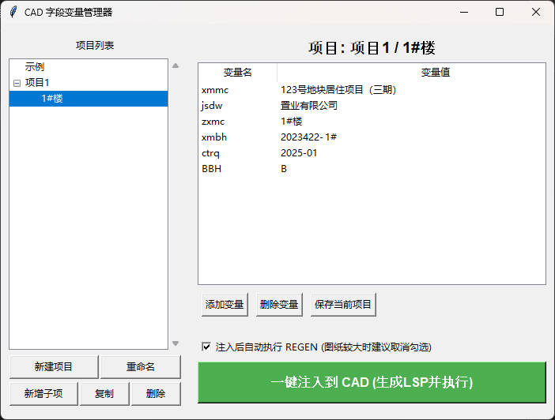

# CAD 字段变量管理器

这是一个用于快速管理和注入 AutoCAD 字段变量的独立工具。通过可视化界面管理不同项目的常用变量（如项目名称、建设单位、出图日期等），并一键生成 LISP 脚本注入到当前运行的 AutoCAD 中，极大提升图纸信息的修改效率。



## 功能特点

- 🗂 **层级项目管理**：支持“项目组 > 子项”的两层结构，方便对复杂项目进行归类管理。
- 📝 **可视化变量编辑**：通过表格直观地添加、删除、修改 Lisp 变量名和变量值，支持超长文本的便捷输入。
- ⚡ **一键注入 CAD**：自动生成 `GB2312` 编码的 `.lsp` 文件，并通过 COM 接口直接加载到当前活动的 AutoCAD 文档中。
- 🔄 **智能刷新控制**：支持注入后自动执行 `REGEN` 刷新图面；针对内容庞大易卡顿的图纸，可随时取消自动刷新选项，工具会自动记忆您的选择。
- 💾 **本地数据持久化**：所有项目数据均保存在本地 `projects_data.json` 文件中，方便备份和迁移。

## 使用方法

### 1. 环境要求
如果你直接使用打包好的 `.exe` 应用程序，无需安装任何环境，双击运行即可。

如果你想通过 Python 源码运行：
- Python 3.6+
- 依赖库：`pywin32` (用于连接 AutoCAD COM 接口)
  ```bash
  pip install pywin32
  ```

### 2. 界面操作指南
1. **项目列表（左侧）**：
   - **新建项目**：创建一个新的项目组文件夹。
   - **新增子项**：在选中的项目组内创建一个具体的子项目。
   - **复制**：快速复制现有项目的变量配置，以创建新项目。
   - **重命名/删除**：管理项目结构。
2. **变量列表（右侧）**：
   - 选择一个子项后，右侧会列出该项目的所有变量。
   - **添加变量**：输入变量名（如 `xmmc`）和变量值。
   - **双击修改**：双击表格中的变量名或变量值可以直接修改。
3. **注入 CAD**：
   - 确保 AutoCAD 已经打开并且有活动的图纸。
   - 选中需要注入的子项，点击底部醒目的 **一键注入到 CAD** 按钮。
   - 如果遇到权限问题导致 COM 接口注入失败，程序会在当前目录生成 `current_project.lsp` 文件，你可以直接将该文件拖入 AutoCAD 窗口中完成加载。

## 注意事项

- **AutoCAD 权限**：通过 COM 接口控制 AutoCAD 时，如果你的 CAD 是以管理员身份运行的，那么这个工具也需要以管理员身份运行，否则可能会提示注入失败。
- **LISP 文件编码**：工具生成的 `current_project.lsp` 文件固定为 `GB2312` 编码，以确保 AutoCAD 能够正确解析包含中文字符的变量，避免“语法错误”。

## 打包说明

如果需要将源码打包为独立程序发给他人使用，可使用 PyInstaller：

```bash
pyinstaller --noconfirm --onedir --windowed --icon "assets/icon.ico" --name "CAD字段变量管理器" --add-data "data/projects_data.json;data" --add-data "assets/icon.ico;assets" src/main.py
```
> 打包完成后，将 `dist` 目录下的 `CAD字段变量管理器` 整个文件夹压缩发送即可。
